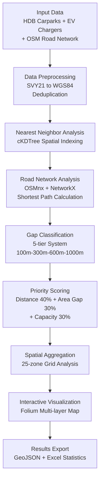

# Spatial Equity Analysis of EV Charging Infrastructure in Singapore's HDB Estates

## — A Sustainable Development Goals Perspective

---

## Introduction

When Singapore announced its goal to phase out internal combustion engine vehicles by 2040, the challenge of equitable EV adoption remained largely unspoken. For the 80% of Singapore's population residing in HDB (Housing Development Board) estates, where daily vehicle parking occurs in shared carparks, the "charging gap"—the distance between parking facilities and public charging infrastructure—becomes a critical determinant of whether the EV transition benefits all citizens or only the privileged few.

This study applies geospatial analysis to systematically assess the charging service gap in Singapore's HDB carparks. Among 2,263 HDB carparks analyzed, while 88.4% demonstrate satisfactory proximity to charging infrastructure, 22 carparks (1%) face moderate to severe service deficits. More critically, these gaps cluster in emerging and peripheral estates like Tengah, Bartley, and Hougang, revealing a spatial equity paradox: the benefits of the green mobility revolution may not reach those who need them most.

*Figure 1: Spatial distribution heatmap of public EV charging infrastructure across Singapore*

## 1. Background: EV Ambitions and HDB Realities

Singapore's urban transport history exemplifies effective spatial constraint management. Through electronic road pricing, vehicle quota systems, and world-class public transit, the city-state has maintained mobility without automobile dependence. The 2021 Singapore Green Plan 2030 introduced the "30-by-30" EV target, subsequently revised to complete phase-out by 2040—a commitment reflecting both climate responsibility and strategic positioning in the global EV supply chain.

Yet the HDB system creates unique EV challenges. Over 90% of Singapore's working population lives in HDB units, typically with one parking space per household. This concentrated parking pattern offers both advantages—charging infrastructure can achieve economies of scale—and complications: shared facilities require collective decision-making, and complex property governance adds coordination costs.

This study addresses three questions: What is the magnitude of the charging gap in HDB estates? How is this gap spatially distributed? Which locations represent priority targets for charging infrastructure deployment?

The analysis aligns with SDG 11 (Sustainable Cities and Communities), emphasizing inclusive and sustainable urban planning; SDG 7 (Clean Energy), ensuring universal access to sustainable energy; and SDG 10 (Reduced Inequalities), addressing how technological transitions may reproduce or ameliorate existing disparities.

## 2. Methodology: Spatial Analysis Techniques

### 2.1 Data and Preprocessing

This study integrates three datasets: HDB carpark information (2,263 records, including coordinates and capacity), public EV charging stations (2,758 points as of January 2026, with operator and charging speed data), and OpenStreetMap road network for Singapore. All coordinates were transformed from SVY21 to WGS84 for spatial compatibility.

### 2.2 Analysis Workflow

### 2.3 Nearest Neighbor Analysis

The study employs cKDTree spatial indexing to compute straight-line distances between each carpark and its nearest public charger. This algorithm achieves computational efficiency—processing thousands of carpark-charger pairs within seconds—while maintaining accuracy.

### 2.4 Road Network Accessibility

Straight-line distance merely approximates actual travel distance in complex urban environments. This study incorporates road network distance using OSMnx and NetworkX to calculate shortest paths between parking facilities and charging points. The optimization algorithm enables full-island analysis while maintaining computational tractability.

### 2.5 Gap Classification and Priority Scoring

A five-tier classification system categorizes charging gaps based on practical travel distance thresholds: Excellent (<100m), Good (100-300m), Moderate Gap (300-600m), High Gap (600-1000m), and Severe Gap (>1000m). These thresholds reflect behavioral research on acceptable walking distances for EV charging integration.

A composite priority scoring model weights three factors: distance (40%), regional gap rate (30%), and carpark capacity (30%). This framework identifies not only gap severity but also deployment efficiency—larger carparks with significant gaps yield higher social returns on charging infrastructure investment.

*Figure 2: Interactive map with satellite/light map toggle functionality*

## 3. Key Findings

### 3.1 Aggregate Statistics

*Figure 3: Distribution of HDB carparks by charging gap classification*

| Category | Count | Percentage |
|----------|-------|------------|
| Excellent (<100m) | 2,001 | 88.4% |
| Good (100-300m) | 240 | 10.6% |
| Moderate Gap | 19 | 0.8% |
| High Gap | 3 | 0.1% |

Mean straight-line distance: 26.9 meters; Median: ~0 meters.

### 3.2 Service Blind Spots

Despite aggregate optimism, 22 carparks (1%) face moderate or higher service deficits. The top 10 priority carparks cluster in Tengah—a newly developing estate—and peripheral areas like Bartley and Hougang. Tengah's appearance is particularly significant: as a greenfield development, its charging infrastructure lag suggests systemic underinvestment in anticipatory planning for emerging infrastructure needs.

*Figure 4: Top 10 priority carparks identified by composite scoring model*

### 3.3 Road vs. Straight-Line Distance

The analysis reveals substantial discrepancies between straight-line and road distances. For certain high-gap carparks, actual travel distance exceeds straight-line distance by a factor of two or more. This finding validates the methodological choice to incorporate road network analysis rather than relying solely on Euclidean metrics.

## 4. Discussion: Spatial Justice and EV Transition

### 4.1 The Equity Paradox

The spatial clustering of service gaps in Tengah, Bartley, and Hougang—rather than random distribution—suggests systematic rather than accidental exclusion. These estates house working-class populations; their relative disadvantage in charging access may compound existing socioeconomic stratification. If EV adoption benefits primarily private condominium owners with dedicated parking, the green transition risks creating a two-tier mobility system: sustainable for the affluent, challenging for the majority.

### 4.2 Temporal Coordination Failures

Tengah's case illustrates infrastructure timing problems. Urban expansion often follows a "build-first,配套-later" logic where residents move in before public services mature. For traditional utilities, this delay is tolerable; for emerging demands like EV charging, timing misalignment creates path dependencies that are difficult to correct retroactively. Future new town development must incorporate EV infrastructure as essential rather than optional amenities.

### 4.3 From "Sufficient" to "Effective"

Physical proximity alone does not guarantee service effectiveness. A charger 300 meters away with two-hour queues may be practically less accessible than a 500-meter charger with immediate availability. Future planning should evolve from coverage metrics toward service effectiveness assessment, incorporating utilization rates, wait times, and user experience.

Singapore's strengths—compact urban form, strong governance capacity, and advanced digital infrastructure—position it well for integrated EV infrastructure planning. This study's spatial framework offers methodological support for embedding charging equity into urban development decisions.

## 5. Policy Recommendations

1. **Prioritize identified service blind spots**: Integrate Tengah, Bartley, Hougang, and other high-priority areas into accelerated deployment programs with subsidies, expedited approvals, and coordinated HDB engagement.

2. **Mandate EV readiness in new developments**: Require new HDB towns to incorporate charging infrastructure capacity—cable conduits, electrical capacity, and parking allocation—as standard rather than optional provisions.

3. **Establish dynamic monitoring systems**: Complement static spatial analysis with real-time tracking of charger utilization, wait times, and accessibility metrics to identify emerging service gaps.

4. **Pursue diversified charging solutions**: Complement public infrastructure with workplace charging programs, commercial building sharing schemes, and residential slow-charger subsidies to create a resilient dual-track system.

## 6. Limitations and Future Directions

This study acknowledges several limitations. First, the analysis assumes driving as the primary mode to chargers—future research should incorporate pedestrian accessibility for non-drivers. Second, supply-side analysis alone cannot capture demand-side dynamics; EV ownership distribution data would enable demand-supply matching. Third, static road networks ignore real-time traffic conditions; dynamic accessibility modeling could enhance accuracy. Finally, the priority scoring weights (40%-30%-30%) reflect expert judgment; participatory methods or machine learning from usage data could refine these parameters.

## Conclusion

When an EV leaves the showroom, it initiates not merely a new mobility journey but a social experiment in sustainable urban development. Technology provides possibilities; institutions determine equity.

Singapore's EV transition success depends not only on charging infrastructure quantity but on fair spatial distribution. This study's significance lies not only in identifying 22 service blind spots but in raising a fundamental question: Are we willing to pay additional institutional costs for equitable distribution in pursuit of maximum efficiency?

The answer will shape Singapore's EV transition: Will it become an inclusive city where green mobility benefits all, or an elite enclave where sustainable infrastructure serves those capable of early adoption?

The journey from HDB carparks to sustainable futures may be short—but only if we walk it fairly.

---

## References

1. United Nations. (2015). *Transforming Our World: The 2030 Agenda for Sustainable Development*. https://sdgs.un.org/2030agenda

2. Ministry of Sustainability and the Environment, Singapore. (2021). *Singapore Green Plan 2030*. https://www.greenplan.gov.sg/

3. Land Transport Authority, Singapore. (2021). *Singapore's Electric Vehicle Roadmap*. https://www.lta.gov.sg/

4. Housing & Development Board, Singapore. (2023). *HDB Annual Report 2022/2023*. https://www.hdb.gov.sg/

5. Zhang, Y., Zou, B., Li, M., & Tan, Q. (2020). The spatial diffusion of electric vehicle charging infrastructure: Evidence from China. *Energy Policy*, 136, 111036.

6. Nie, Y., & Ghamami, M. (2013). A corridor-centric approach to planning electric vehicle charging infrastructure. *Transportation Research Part B: Methodological*, 57, 172-190.

7. United Nations. (2016). *Habitat III Issue Papers: 11 - Urban Ecosystems*. New York: United Nations.

---

*This study uses Singapore government open data and OpenStreetMap road network data. Spatial analysis was implemented using Python's geodata science toolkit. Views expressed are those of the researchers for academic discussion purposes only.*
